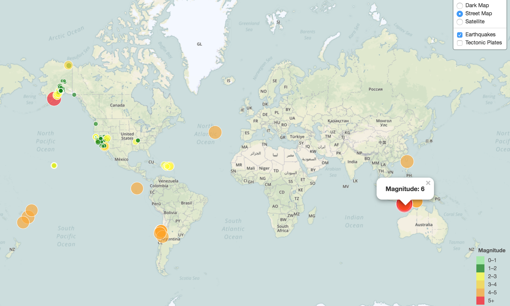
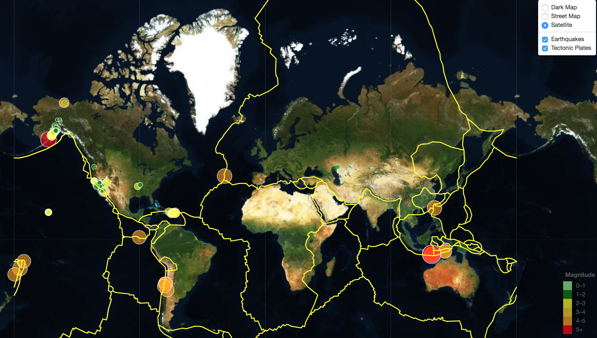

# EarthQuake-Geomapping

The objective of this project is to visualize earthquakes occurring globally using a live API feed provided by the USGS(United States Geological Survey) which is updated every 5 mins. The data set used here includes all earthquakes occurred over the past 7 days.The technology used in developing the application are leaflet.js, HTML/CSS/Bootstrap/Javascript, GeoJSON.  

The screenshot below is the visualization of earthquake data set. Data source used here is from https://earthquake.usgs.gov/earthquakes/feed/v1.0/summary/all_day.geojson

Using a second dataset, included an additional layer of tectonic plates on the map to illustrate the relationship between tectonic plates and seismic activity. The source for this data is from https://github.com/fraxen/tectonicplates. 
The following screenshot below illustrates the relationship.

